### API开放平台项目


> 背景：
>
> 1. 前端开发需要用到后台接口
> 2. 使用现成的系统的功能【http://api.btstu.cn/】
>
>
>
> 做一个API 接口平台：
>
> 1. 防止攻击（安全性）
> 2. 不能随便调用（限制、开通）
> 3. **统计调用次数**
> 4. 计费
> 5. 流量保护
> 6. API 接入


前端：https://github.com/Ding-Jiaxiong/xiongapi_frontend

后端：https://github.com/Ding-Jiaxiong/xiongapi_backend


#### 1. 项目概述


本项目是一个面向开发者的`API`平台，提供`API`接口供开发者调用。用户通过注册登录，可以开通接口调用权限，并可以浏览和调用接口。每次调用都会进行统计，用户可以根据统计数据进行分析和优化。管理员可以发布接口、下线接口、接入接口，并可视化接口的调用情况和数据。本项目侧重于后端，涉及多种编程技巧和架构设计层面的知识。


#### 2. 项目介绍


一个提供API接口供开发者调用的平台：

管理员可以发布接口，同时统计分析各接口的调用情况，用户可以注册登录并开通接口调用权限，浏览接口以及在线进行调试，并可以使用`SDK`轻松地在代码中调用接口。该项目前端简单，后端丰富，涵盖编程技巧和架构设计等多个技术领域。

主页（浏览接口）：


接口管理：


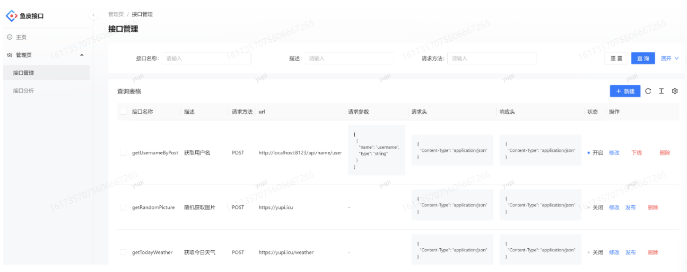


在线调试：


使用自己开发的客户端SDK,一行代码调用接口：


为什么做这个项目？

1. 该项目足够新颖，与大家在学校所做的管理系统、商城项目等有所不同。
2. 开放平台类的项目通常只由知名企业或产品提供，因此该项目的建设和提供也很特别。
3. 相比于其他技术领域，开放平台类的项目缺乏相关的教程和文章，相当匮乏。


业务流程图：


#### 3. 项目开发流程


##### 3.1 技术选型


###### 3.1.1 前端


- Ant Design Pro
- React
- Ant Design Procomponents
- Umi
- Umi Request(Axios的封装)


###### 3.1.2 后端


- Java Spring Boot
- Spring Boot Starter(SDK开发)
- Dubbo (RPC)
- Nacos
- Spring Cloud Gateway(网关、限流、日志实现)


##### 3.2 需求分析


1. 管理员可以对接口信息进行增脚改查
2. 用户可以访问前台，查看接口信息


##### 3.3 项目初始化


###### 3.3.1 前端初始化


还是Ant design pro


这次用`pro` 命令，其实在用户中心就已经用过了


我的是3.1 的，鱼皮不知道


`pro create xiongapi_frontend`


> 鱼皮创建项目那天是2022年10月


这次我直接换成最新版


> 回来了


pro 版本 →


这次用`umi4`


`yarn` 安装依赖


爆了， 之前遇到过，用`npm install`


其实版本都高了，换一下，`pro ` 降到 `2.1` 的版本


再试一次


直接坑，这个版本不行，命令都不一样了，算了，高点就高点吧，这个项目重点在后端


依赖安装完成后，直接启动


npm 成功了


`dev` 启动


`8000` 端口跑起来了


哇哦，这个界面好像比低版本更高级一点，用户中心那个


当然现在没法儿登录，`mock = none`


开启mock 再试一次


这次就能进来了


快速瘦身

国际化干掉


这个目录也直接干掉


擦


解决一下


这里删掉就行了


没问题，`e2e` 我本来也没有


tests 也直接干掉，自动化测试框架我这儿也没有，差不多就得了


###### 3.3.2 后端初始化


使用模板吧【这里我看pom 文件应该是旧版本的】


就这个


写了挺多东西的，改改项目名和包名


换了个banner：


创建数据库表


模板也给了


启动成功，访问接口文档


测试一下用户接口


帖子接口


分页也能用，全部查无权限


##### 3.4 数据库表设计


###### 3.4.1 接口信息表


```sql
-- 接口信息
create table if not exists xiongapi.`interface_info`
(
    `id`             bigint                             not null auto_increment comment '主键' primary key,
    `name`           varchar(256)                       not null comment '名称',
    `description`    varchar(256)                       null comment '描述',
    `url`            varchar(512)                       not null comment '接口地址',
    `requestHeader`  text                               null comment '请求头',
    `responseHeader` text                               null comment '响应头',
    `status`         int      default 0                 not null comment '接口状态(0-关闭，1-开启)',
    `method`         varchar(256)                       not null comment '请求类型',
    `userId`         bigint                             not null comment '创建人',
    `createTime`     datetime default CURRENT_TIMESTAMP not null comment '创建时间',
    `updateTime`     datetime default CURRENT_TIMESTAMP not null on update CURRENT_TIMESTAMP comment '更新时间',
    `isDelete`       tinyint  default 0                 not null comment '是否删除(0-未删，1-已删)'
) comment '接口信息';
```


随机数据其实就不用管了，那些网址都是假的


随便搞了点


##### 3.5 代码自动生成


###### 3.5.1 后端Swagger文档


直接mybatis-plus 自动生成


直接finish


然后就是`Ctrl` + `CV`


控制器也直接贴


后端接口就一整个贴贴贴


必须要管理员才能查


###### 3.5.2 前端Open API


配置 `ESLint`


现在是自动识别


格式化代码


自动格式化


**前端接口调用**


`oneapi` 插件自动生成 → `openapi` 规范


swagger 接口文档中：


一堆`JSON` 对象，复制这个`URL`


放在这里


运行这个脚本命令


妙啊


`666`

改一下请求地址：


这样就完成了


##### 3.6 用户登录页面开发


请求接口都不对，要改一下啊


我这儿跨域了


其实这里也已经配置过跨域了，踩坑开始


很神奇的是，我把后端跑在8080 端口就解决了


数据也返回了


我又改回去了7259，又行了... 离谱，我们要把用户状态保存下来


水印和头像也都改一下啊


加上cookie


再试一次


又踩，我决定直接把鱼皮的`package.json` 拿过来用


再试一次


擦，试试`yarn`


还是爆了


重新`npm install ` 了一下，又进来了


死这儿了


再试一次，这就是代码版本的问题吗，【我决定重新来一遍】想办法装一个和鱼皮一样的


> 这里返回到了前端初始化


回来了，其实没啥问题，可能哪里删多了东西啥的，又跑起来了


进来了


这里用户名和头像展示还有点问题


在这个组件里面


这样就出来了


退出登录返回登录页面


OK


其实这里真的我也遇到了要登录两次的问题，想到那个状态还没设置上就跳转了，看了广大鱼友的解决方案


定时器太骚了


##### 3.7 接口管理功能开发


我的没改参数 ...


直接就出来了... 炸裂啊


##### 3.8 接口列表页面开发


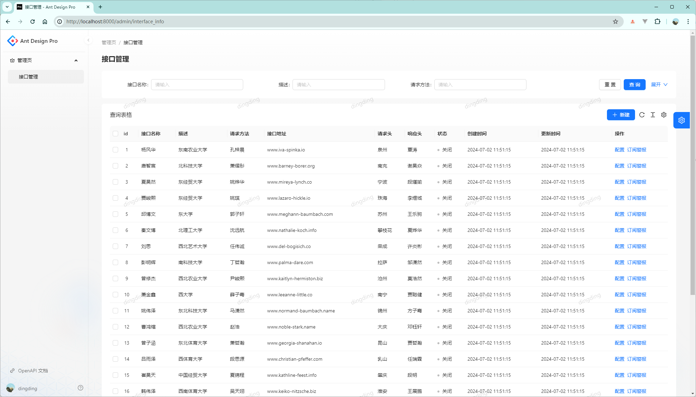


##### 3.9 接口管理功能


###### 3.9.1 前端页面开发


新建


提交


> 就是要刷一下，这里可以加一个调用


修改：


这个更新这里一定要把ID 带上，鱼总暂时没发现


这样就更新成功了


删除：


设置下自动刷新


##### 3.10 模拟接口项目


###### 3.10.1 示例接口开发


新建项目


就这仨依赖，直接创建


直接干控制器


项目名称：xiongapi_interface

提供三个不同种类的模拟接口：

1. GET接☐

2. POST接口(url传参)
3. POST接☐(Restful)


废话文学：一个开发者能查询自己名字的接口


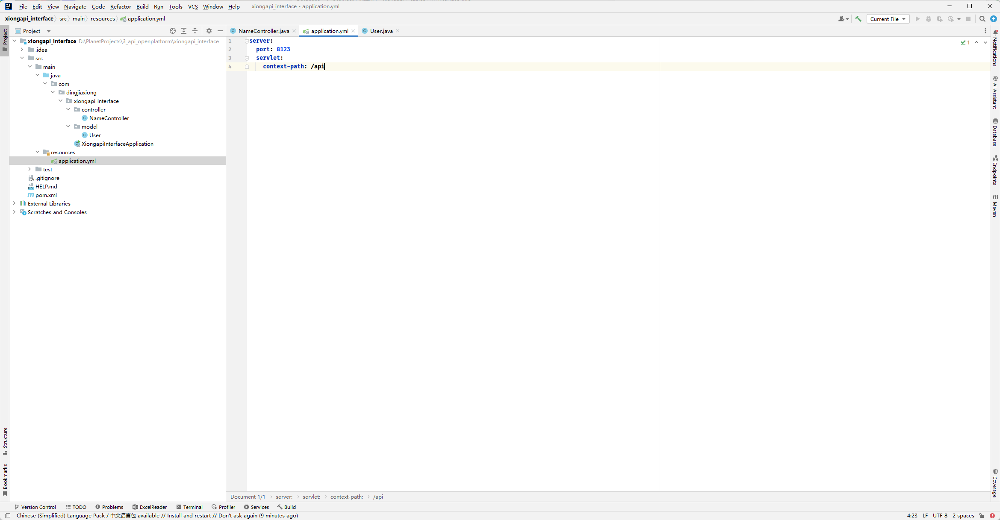


直接启动


###### 3.10.2 HTTP客户端调用


用程序的方式来请求


几种HTTP调用方式：

1. HttpClient

2. RestTemplate
3. 第三方库(OKHTTP、Hutool：https://hutool.cn/docs/#/)


添加依赖：


```xml
<dependency>
    <groupId>cn.hutool</groupId>
    <artifactId>hutool-all</artifactId>
    <version>5.8.16</version>
</dependency>
```


新建客户端：


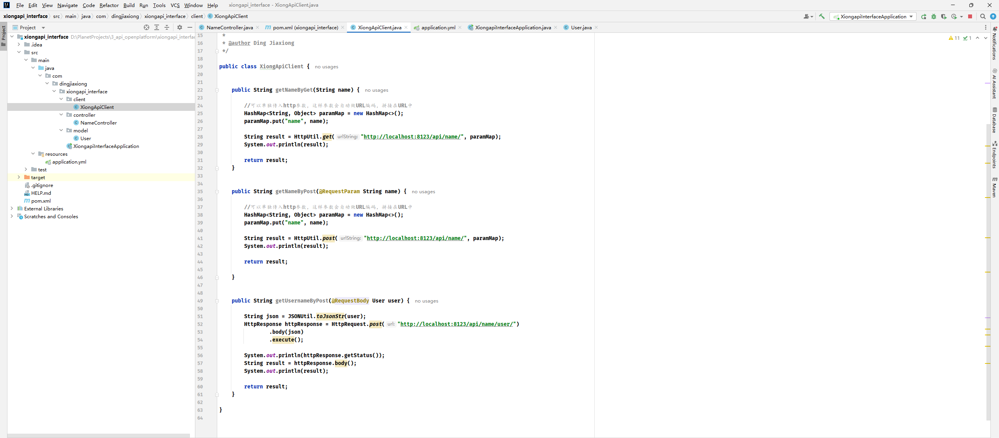


测试类走你


直接干了个main，好家伙


##### 3.11 API签名认证详解及实战


本质：

1. 签发签名
2. 使用签名（校验签名）


为什么需要？

1. 保证安全性，不随便一个人调用
2. 适用于无需保存登录态的场景。只认签名，不关注用户登录态。


**签名认证实现**


> 今天先做到这儿，先准备小组会


通过`http request header`头传递参数。

参数1：accessKey:调用的标识userA,userB(复杂、无序、无规律)

参数2：secretKey:密钥（复杂、无序、无规律）**该参数不能放到请求头中**

(类以用户名和密码，区别：ak、sk是无状态的)


给用户分配一个，用户表添加字段


重新建


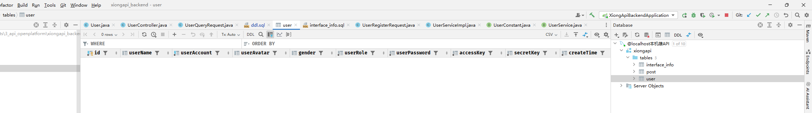


给第一个用户设置了这样一对

> 大家可以自己写代码来给用户生成ak、sk


修改客户端


修改调用


修改校验


修改发送请求


运行调用


当然这里是正确的，所以直接可以通过校验


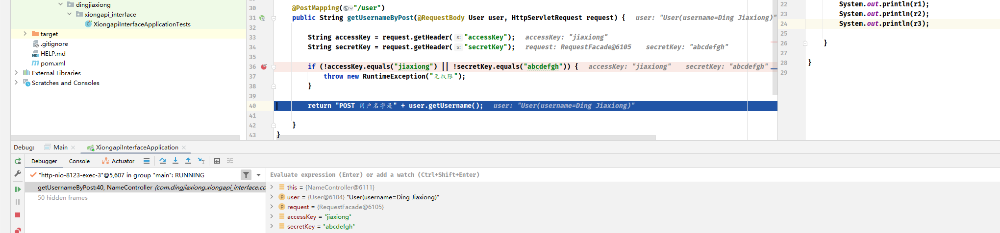


如果错误


这样就过不去


这样做的问题也很明显，千万不把密钥直接在服务器之间传递，有可能会被拦截

参数3：用户请求参数

参数4：sign

加密方式：对称加密、非对称加密、md5签名（不可解密）

用户参数+密钥=>签名生成算法(MD5、HMac、Sha1)=>不可解密的值

abc + abcdefgh =sajdgdioajdgioa

服务端怎么知道这个签名对不对？

→ 服务端用一模一样的参数和算法去生成签名，只要和用户传的的一致，就表示一致。

**怎么防重放**？

参数5：加nonce随机数，只总用一次

服务端要保存用过的随机数

参数6：加timestamp时间戳，校验时间戳是否过期。

API签名认证是一个很灵活的设计，具体要有哪些参数、参数名如何一定要根据场景来。（比如userld、appld、version、固定值等）


客户端添加头部信息：


并且经过了签名


改了一下


修改服务端：


测试一下


这样就通过，如果secretKey 不对


报没有权限


当然中文会乱码，


把body 参数用utf-8 编码一下就行了，感谢鱼友


##### 3.12 客户端SDK开发


思考：难道开发者每次调用接口都要自己写签名算法？【自己做一个`SDK`】


→ 理想情况：开发者只需要关心调用哪些接口、传递哪些参数，就跟调用自己写的代码一样简单。


为什么需要Starter?

开发`starter`的好处：开发者引入之后，可以直接在`application.yml`中写配置，自动创建客户端


新建项目：


就这样就行


一个干净的非Web 项目

改`pom`


这里稍微有点不一样，保险起见，改成和鱼皮一样的


`spring-boot-configuration-processor`的作用是自动生成配置的代码提示

初始化，环境依赖（一定要移除build):


启动类干掉，加一个配置类


之前的代码都拿过来


测试类也删掉，直接install


打包成功，在之前的interface 里面看能不能用


这仨直接全干掉


引入我们自己那个依赖，已经install 到本地了


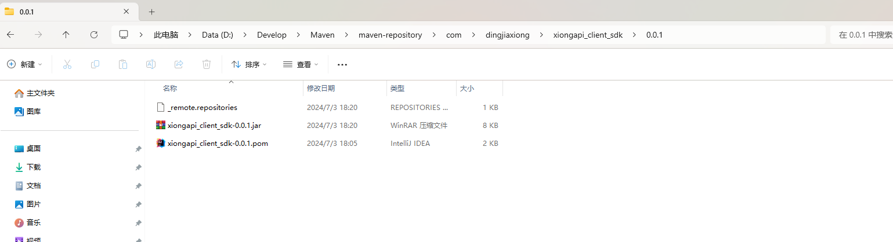


直接引入成功


这里也有提示了


再来测试一次，这里鱼皮把utils 和 model 都拿过来了，我觉得没必要把. .. 【好，他改正了】


没问题，中文乱码问题也没问题，如果密钥改一下啊


500 ，没有权限，666【简历加分】


##### 3.13 接口管理功能


**发布 / 下线接口开发** 【管理员】


status 就对应了


权限控制：仅管理员可操作。

**业务逻辑**

发布接口：

1. 校验该接口是否存在
2. 判断该接口是否可以调用
3. 修改接口数据库中的状态字段为1

下线接口：

1. 校检该接☐是否存在
2. 修改接口数据库中的状态字段为0


> 从这一节开始，所有项目都放到一个文件夹下了


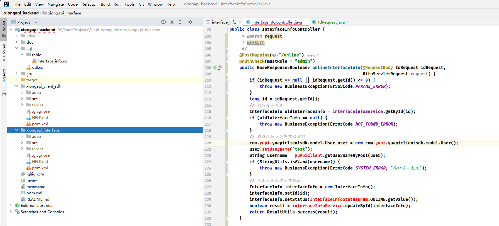


我也直接切进来了


之前的这个项目要跑起来


引入上次做的sdk


并且配置一下


上线和下线接口接口：


前端页面修改：


后端改了，前端重新生成联调代码


前端调用接口


试试


没问题【其实有点小问题，展示那儿】


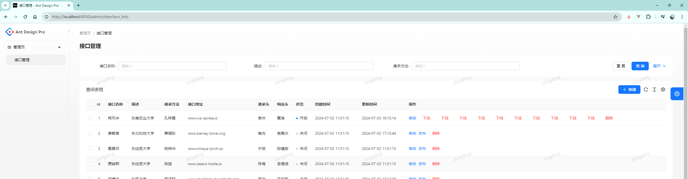


离谱了，每次刷新都要加


##### 3.14 在线调试接口功能


###### 3.14.1 前端页面开发


前端去浏览接口、查看接口文档、申请签名（注册）


浏览接口


查看接口：

思路：动态路由，用url 来传递id,加载不同的接口信息


申请签名：用户在注册成功时，自动分配accessKey、secretKey

修改注册业务：


试试


自动分配了


创建一个真实一点的接口测试：


其实就是我们另一个子项目的接口


这里整个少了一个请求参数，离谱


都补上了，前端重新生成


牛逼啊，


直接修改一下


提交


可以


又改了下


虽然数据里面有点怪


增加调用界面


调用流程：【上】


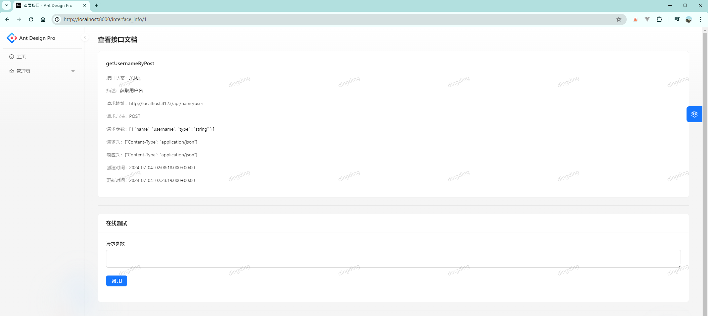


流程：

1. 前端将用户输入的请求参数和要测试的接口id发给平台后端
2. (在调用前可以做一些校验)
3. 平台后瑞去调用模拟接口


###### 3.14.2 后端接口开发


测试一下


试一下


接口发布


没毛病，请求成功，我们的ak和sk 都是对的，

但是这都是在另一个项目中写死的


如果换一个用户，就算`sk`对都不行了


##### 3.15 接口调用统计功能


**后端开发**


需求：

1. 用户每次调用接口成功，次数+1
2. 给用户分配或者用户自主申请接口调用次数

业务流程：

1. 用户调用接口（之前已完成）

2. 修改数据库，调用次数+1

设计库表：
哪个用户？哪个接口？

用户=>接口（多对多）


用户调用接口关系表：


```sql
-- 用户调用接口关系表
create table if not exists xiongapi.`user_interface_info`
(
    `id` bigint not null auto_increment comment '主键' primary key,
    `userId` bigint not null comment '调用用户 id',
    `interfaceInfoId` bigint not null comment '接口 id',
    `totalNum` int default 0 not null comment '总调用次数',
    `leftNum` int default 0 not null comment '剩余调用次数',
    `status` int default 0 not null comment '0-正常，1-禁用',
    `createTime` datetime default CURRENT_TIMESTAMP not null comment '创建时间',
    `updateTime` datetime default CURRENT_TIMESTAMP not null on update CURRENT_TIMESTAMP comment '更新时间',
    `isDelete` tinyint default 0 not null comment '是否删除(0-未删, 1-已删)'
) comment '用户调用接口关系';
```


代码生成器


增删改查接口复制


给调用逻辑加上

开发步骤：

1. 开发基本增删改查（给管理员用）
2. 开发用户调用接口次数+1的功能(service)


测试类搞一下：


运行应该变3、4


成功执行


OK


问题

如果每个接口的方都写调用次数+1，是不是比较麻烦？

致命问题：接口开发者需要自己去添加统计代码


使用AOP切面的优点：独立于接口，在每个接口调用后统计次数+1

AOP切面的缺点：只存在于单个项目中，如果每个团队都要开发自己的模拟接口，那么都要写一个切面


##### 3.16 API网关详解


###### 3.16.1 网关介绍及优点


什么是网关？理解成火车站的检票口，统一去检票。

作用

统一去进行一些操作、处理一些问题。


###### 3.16.2 11种网关应用场景


1. 路由

   起到转发的作用，比如有接口A和接口B,网关会记录这些信息，根据用户访问的地址和参数，转发请求到对应的接口（服务器/集群）
   `/a` => 接☐A
   `/b` => 接☐B

   https://docs.spring.io/spring-cloud-gateway/docs/current/reference/html/#gateway-request-predicates-factories

2. 负载均衡

   在路由的基础上
   `/c`=>服务A/集群A(随机转发到其中的某一个机器)
   uri从固定地止改成lb:xxxxx

3. 统一鉴权

   判断用户是否有权限进行操作，无论访问什么接口，我都统一去判断权限，不用重复写。

4. 跨域

   网关统一处理跨域，不用在每个项目里单独处理

   https://docs.spring.io/spring-cloud-gateway/docs/current/reference/html/#cors-configuration

5. 统一业务处理（缓存）

   把一些每个项目中都要做的通用逻辑放到上层（网关），统一处理，比如本项目的次数统计

6. 访问控制

   黑白名单，比如限制DDOS IP

7. 发布控制

   灰度发布，比如上线新接口，先给新接口分配20%的流量，老接口80%，再慢慢调整比重。

   https://docs.spring.io/spring-cloud-gateway/docs/current/reference/html/#the-weight-route-predicate-factory

8. 流量染色

   给请求（流量）添加一些标识，一般是设置请求头中，添加新的请求头

   https://docs.spring.io/spring-cloud-gateway/docs/current/reference/html/#the-addrequestheader-gatewayfilter-factory

   全局染色：https://docs.spring.io/spring-cloud-gateway/docs/current/reference/html/#default-filters

9. 接口保护

    - 限制请求

      https://docs.spring.io/spring-cloud-gateway/docs/current/reference/html/#requestheadersize-gatewayfilter-factory

    - 信息脱敏

      https://docs.spring.io/spring-cloud-gateway/docs/current/reference/html/#the-removerequestheader-gatewayfilter-factory

    - 降级（熔断）

      https://docs.spring.io/spring-cloud-gateway/docs/current/reference/html/#fallback-headers

    - 限流：学习令牌桶算法、学习漏桶算法，学习一下RedisLimitHandler

      https://docs.spring.io/spring-cloud-gateway/docs/current/reference/html/#the-requestratelimiter-gatewayfilter-factory

    - 超时时间

      https://docs.spring.io/spring-cloud-gateway/docs/current/reference/html/#http-timeouts-configuration

    - 重试

      https://docs.spring.io/spring-cloud-gateway/docs/current/reference/html/#the-retry-gatewayfilter-factory

10. 统一日志

    统一的请求、响应信息记录

11. 统一文档

    将下游项目的文档进行聚合，在一个页面统一查看


###### 3.16.3 网关分类及技术选型


1. 全局网关（接入层网关）：作用是负载均衡、请求日志等，不和业务逻辑绑定
2. 业务网关（微服务网关）：会有一些业务逻辑，作用是将请求转发到不同的业务/项目/接口/服务


###### 技术选型

1. Nginx(全局网关)、Kong网关(API网关，Kong:https://github.com/Kong/kong),编程成本相对高一点
2. Spring Cloud Gateway(取代了Zuul)性高、可以用Java代码来写逻辑，适于学习


参考文章：https://zhuanlan.zhihu.com/p/500587132


###### 3.16.4 Spring Cloud Gateway教程


官网：https://spring.io/projects/spring-cloud-gateway


文档：https://docs.spring.io/spring-cloud-gateway/docs/current/reference/html/


###### 3.16.5 Spring Cloud Gateway实现


**核心概念**


路由（根据什么条件，转发请求到哪里）

断言：一组规则、条件，用来确定如何转发路由

过滤器：对请求进行一系列的处理，比如添加请求头、添加请求参数


请求流程：

1. 客户端发起请求
2. Handler Mapping:根据断言，去将请求转发到对应的路由
3. Web Handler:处理请求（一层层经过过滤器）
4. 实际调用服务


新项目走起


就这仨


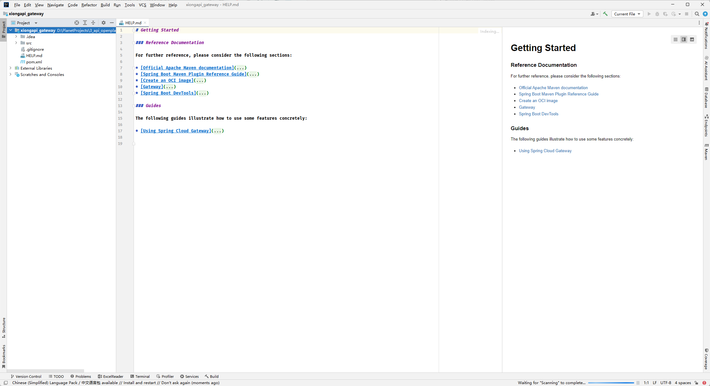


直接改启动类


8090 启动


额密密麻麻


但是这个好像确实 ... 生效了【就是把路径也带过去了，所以404】


两种配置方式

1. 配置式（方便、规范）
   i.简化版
   ⅱ.全称版
2. 编程式（灵活、相对麻烦）


实现：


转了


**断言**

1. After在xx时i间之后
2. Before在xx时间之前
3. Between在xx时间之间
4. 请求类别
5. 请求头（包含Cookie)
6. 查询参数
7. 客户端地址
8. 权重


**过滤器**

基本功能：对请求头、请求参数、响应头的增删改查

1. 添加清求头
2. 添加清求参数
3. 添加响应头
4. 降级
5. 限流
6. 重试


改一个接口


配置网关


先这样看看


访问网关


也过去了，一模一样的响应，但是地址是不一样的


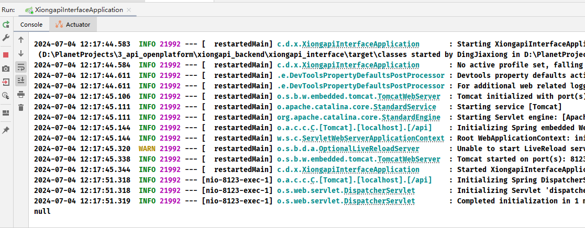


当然请求头没有这个东西，加上


再来一次


这样就拿到了


如果请求参数name


妙


降级：


```xml
<dependency>
    <groupId>org.springframework.cloud</groupId>
    <artifactId>spring-cloud-starter-circuitbreaker-reactor-resilience4j</artifactId>
</dependency>
```


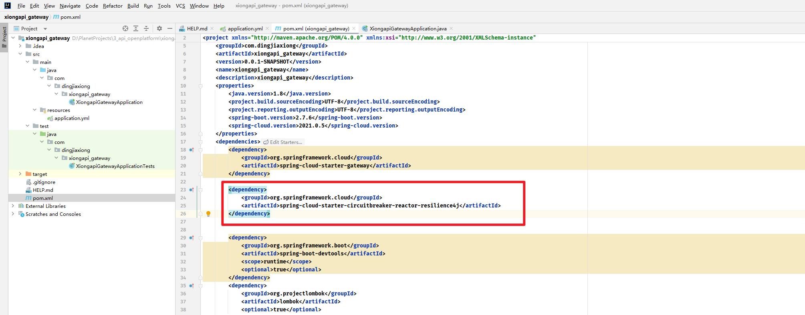


简单来说就是备选地址：

试试


这是springboot 做的404 【不好测试，但是会触发，听明白了】


##### 3.17 接口调用统计功能


###### 3.17.1 优化方案分析及对比


要用到的网关特性：

1. 路由（转发请求到模拟接口项目）
2. ~~负载均衡（需要用到注册中心)~~
3. 统一鉴权(accesskey,secretKey)
4. ~~跨域~~
5. 统一业务处理（每次请求接口后，接口调用次数+1）
6. 访问控制（黑白名单）
7. ~~发布控制~~
8. 流量染色（记录请求是否为网关来的）
9. ~~接口保护~~
    - 限制请求
    - 信息脱敏
    - 降级（熔断）
    - 限流：学习令牌桶算法、学习漏桶算法，学习一下RedisLimitHandler
    - 超时时间
10. 统一日志（记录每次的请求和响应日志）
11. ~~统一文档~~


**业务逻辑**


1. 用户发送请求到API网关
2. 请求日志
3. (黑白名单)
4. 用户鉴权（判断ak、sk是否合法）
5. 请求的模以接口是否存在？
6. 请求转发，调用模拟接口
7. 响应日志
8. 调用成功，接口调用次数+1
9. 调用失败，返回一个规范的错误码


###### 3.17.2 统一业务处理（鉴权 + 统计）


**统一实现**


修改之前的接口项目


1


**请求转发：**

使用前缀匹配断言：https://docs.spring.io/spring-cloud-gateway/docs/current/reference/html/#the-path-route-predicate-factory

所有路径为：`/api/`的请求进行转发，转发到`http://localhost:8123/api/`


比如请求网关：http://localhost:8090/api/name/get?name=dingjiaxiong

转发到：           http://localhost:8123/api/name/get?name=dingjiaxiong


配置文件改改就行：


测试：


转发成功


确实是调到了


**编写业务逻辑**


使用了GlobalFilter(编程式)，全局请求拦截处理（类似AOP)


先看这玩意儿有没有生效


没问题


现在就实现我们自己的业务逻辑


因为网关项目设引入MyBatis等操作数据库的类库，如果该操作较为复杂，可以由backend增删改查项目提供接口，我们直接调用，不用再重复写逻辑了。

- HTTP请求（用HTTPClient、用RestTemplate、Feign)
- RPC(Dubbo)


先改一下客户端：


之前是在这里直接写死了，现在我们要改成访问网关


`8090` 直接提出来


重现打包一下这个SDK ，


成功，backend 刷一下


确认，源码里面也已经换了


把网关用debug 模式运行，再来调一次


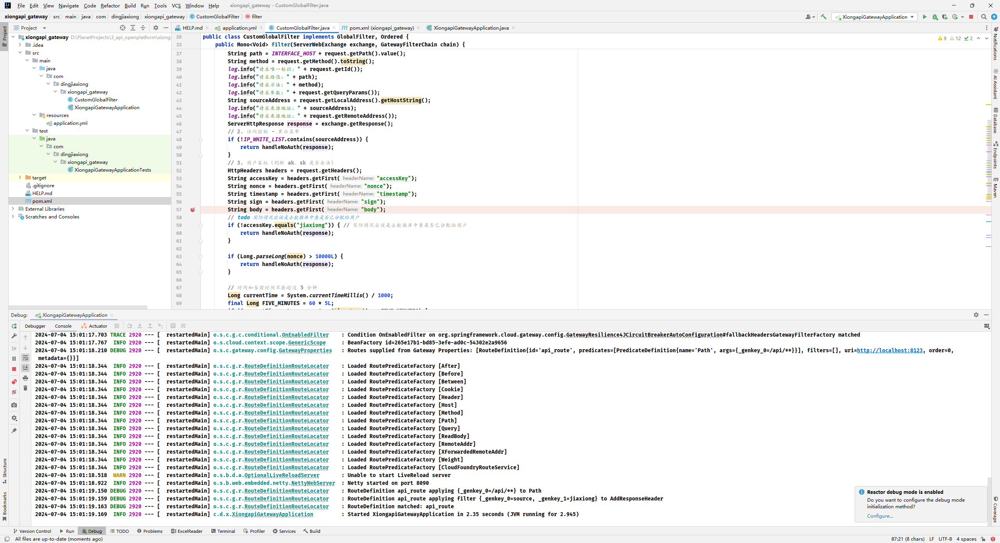


我这儿直接空指针了，擦


看到了，这里什么都没传，所以直接爆了

随便传个参数


正在调用，看网关


过来了


加密签名这些都是正常的


放过去，调用成功了，Mono 是异步的


这边这一步已经走下去了，但是我们的接口还没被调用


网关这边已经完事儿了，模拟接口那边才拿到数据


预期是等模以接口调用完成，才记录响应日志、统计调用次数。

但现实是chain.filter方法立刻返回了，直到filter过滤器return后才调用了模拟接口。

原因是：chain.filter是个异步操作，理解为前端的promise

**解决方案**：利用response装饰者，增强原有response的处理能力


##### 3.18 分布式改造


###### 3.18.1 RPC和HTTP调用详解


到这里所有子项目都放到一起了


问题：网关项目比较纯净，没有操作数据库的包、并且还要调用我们之前写过的代码？复制粘贴维护麻烦

理想：直接请求到其他项目的方法


**怎么调用其他项目的方法？**


1. 复制代码和依赖、环境
2. HTTP请求（提供一个接口，供其他项目调用）
3. RPC
4. 把公共的代码打个jar包，其他项目去引用（客户端SDK)


**HTTP**请求怎么调用？


**RPC**

作用：像调用本地方法一样调用远程方法。

和直接HTTP调用的区别：

1. 对开发者更透明，减少了很多的沟通成本。

2. RPC向远程服务器发送请求时，未必要使用HTTP协议，比如还可以用TCP/IP,性能更高。(内部服务更适用)


RPC调用模型：


###### 3.18.2 Dubbo框架讲解及示例开发


模型已经清楚了，这玩意儿怎么实现，当然是现成的框架


**Dubbo框架(RPC实现)**

> 其他RPC框架：GRPC、TRPC

最好的学习方式：阅读官方文档：

https://cn.dubbo.apache.org/zh-cn/overview/mannual/java-sdk/quick-start/spring-boot/


两种使用方式：

1. Spring Boot代码（注解+编程式）：写Java接口，服务提供者和消费者都去引用这个接口
2. IDL(接口调用语言)：创建一个公共的接口定义文件，服务提供者和消费者读取这个文件。优点是跨语言，所有的框架都认识


Triple 协议：https://cn.dubbo.apache.org/zh-cn/overview/mannual/java-sdk/reference-manual/protocol/triple/


在示例项目https://github.com/apache/dubbo-samples/tree/master/1-basic/dubbo-samples-spring-boot中，


没看见zookeeper，


看见了，现在用的nacos 了


消费者这边也是


> 之前把黑马的微服务的视频看完过，这些概念还是清楚的


整合运用：

1. backend项目作为服务提供者，提供3个方法：
    - 实际情况应该是去数据库中查是否已分配给用户
    - 从数据库中查询模拟接口是否存在，以及请求方法是否匹配（还可以校验请求参数）
    - 调用成功，接口调用次数+1 invokeCount
2. gateway项目作为服务调用者，调用这3个方法


直接动手

先添加依赖版本：

在backend ，这是服务提供，网关gateway那边是服务消费


然后是依赖本身


两个都刷一下


居然还能使，然后是提供者

> 这里已经没法儿看到zookeeper 了，官方都不用了


**这一段其实感觉可以跳过了**


35 集前面40分钟都在踩坑，zookeeper 之前学过，单独在Linux 部署的，集群


###### 3.18.3 Dubbo业务实战


建议大家用Nacos!

整合Nacos注册中心：https://cn.dubbo.apache.org/zh-cn/overview/mannual/java-sdk/reference-manual/registry/nacos/


要先在本地装起来一个nacos：https://github.com/alibaba/nacos/releases/tag/2.3.2，我就直接上最新版了


https://github.com/alibaba/nacos/releases/download/2.3.2/nacos-server-2.3.2.zip


直接启动 `startup.cmd -m standalone` ， 独立节点运行


8848 ， xx 手机，哈哈哈哈


这下我们加入nacos 的依赖就行


配置一下，gateway 那边一样的


配置


启动类加上注解：


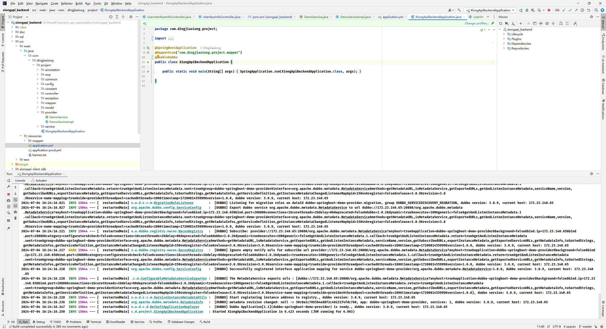


成功启动，同样的gateway 也配一个


虽然中间有一些异常，但是这个不用管


注意：

1. 服务接口类必须要在同一个包下，建议是抽象出一个公共项目（放接口、实体类等）
2. 设置注解（比如启动类的EnableDubbo、接口实现类和Bean引用的注解）
3. 添加配置
4. 服务调用项目和提供者项目尽量引入相同的依赖和配置


服务其实已经注册了


用一下


没问题


###### 3.18.4 公共模块抽象


看看之前遗留的问题


接口项目的校验，这下就可以用到远程调用了


**公共服务**

目的是让方法、实体类在多个项目间复用，减少重复编写。


服务抽取：

1. 数据库中查是否已分配给用户秘钥（根据accessKey拿到用户信息，返回用户信息，为空表示不存在）
2. 从数据库中查询模拟接口是否存在（请求路径、请求方法、请求参数，返回接口信息，为空表示不存在）
3. 接口调用次数+1 invokeCount(accessKey、secretKey(标识用户)，请求接☐路径)


步骤：

1. 新建干净的maven项目，只保留必要的公共依赖
2. 抽取service和实体类
3. install本地maven包
4. 让服务提供者引入common包，测试是否正常运行
5. 让服务消费者引入common包


来吧。


开第五个


这里就选Java，然后就是最普通的maven 工程


OK，然后就是贴贴贴了


三个提供的服务


这边这个就不用写了


直接install


OK，在backend 那边调用一下啊


注意改下版本呢


> 这里其实有点乱，那个inner 那个东西，最后是单独抽出来单独改的


这里的`inner` 单独去专门实现在common 里面定义的三个服务接口


这两个都是common 包里面的


这三个方法，然后就是各个方法还有控制器的实体类，要改成common 包里面的


比如这种全部要改


经过一顿改，终于构建完成了 【经典：删掉的文件回滚】


启动一下看看注册中心


三个服务，我去，真艰难

其实我们这里只校验了ak，是直接校验的加密之后的那一坨信息


这个测试也能直接跑通了


然后就是改网关那边，因为现在请求校验那些都在网关，网关是服务消费者

网关引入我们的common 包


引入三个服务


改之前的死的实现


OK，来吧，最后的测试，启动backend


注册中心：


没问题，启动网关


好，皮总也是一样的错误，数一口气，直接在网关禁用掉


再来一次


OK，起来了


再一个就是我们真正的接口，跑在`8123`


来吧，请求一下啊


擦，给网关来个断点


日志感觉没问题


看见了，我的请求地址有问题，靠，在这儿就被拦下来了


好，皮总也要被拦截，直接前端调用，浏览器直接请求有问题


这次对了，跟下去


其实看到这儿，也没问题了，远程调用已经成功了，用户信息都出来了


接口信息也能直接拿到，666


直接放行，调用完成，当然，之前我们在接口端写的那些校验就可以注掉了，我们都在网关层实现了


这些都不用要了，看看次数有没有修改


再来一次，不打断点了，现在这个人是 6 1


请求成功，看看现在的数据库


7 0 ，完成了，


##### 3.19 管理员统计分析功能


###### 3.19.1 后端聚合查询接口开发


各接口的总调用次数占比（饼图）取调用最多的前3个接口，从而分析出哪些接口没有人用（降低资源、或者下线），高频接口（增加资源、提高收费）。


写一个接口，得到下列示例数据：

接口A:2次

接口B:3次


步骤：

1. SQL查询调用数据：`select interfacelnfold,sum(totalNum)as totalNum from user_interface_info group by interfacelnfold order by totalNum desc limit3`;
2. 业务层去关联查询接口信息


造一些假数据


###### 3.19.2 前端2种可视化库用法


强烈推荐用现成的库！！！


- Echarts：https://echarts.apache.org/zh/index.html
- AntV：https://antv.antgroup.com/
- BizCharts：


用法贼简单！

1. 看官网
2. 找到快速入门、按文档去引入库
3. 进入示例页面
4. 找到你要的图
5. 在线调试
6. 复制代码
7. 改为真实数据


如果是`React`项目，用这个库：https://github.com/hustcc/echarts-for-react


这里直接上echarts：


装依赖：`npm install --save echarts-for-react`


随便搞个测试页面


可以


##### 3.20 项目拓展点及上线分析


准备撒花


**上线计划**


后端：

- backend项目：web项目，部署spring boot的jar包（对外的）
- gateway网关项目：web项目，部署spring boot的jar包（对外的）
- interface模拟接口项目：web项目，部署spring boot的jar包（不建议对外暴露的）

关键：网络必须要连通


**扩展**


1. 用户可以申请更换签名

2. 让其他用户也上传接口

    - 需要提供一个机制（界面），让用户输入自己的接口ost(服务器地址)、接口信息，将接口信息写入数据库。
    - 可以在interfacelnfo表里加个host字段，区分服务器地址，让接口提供者更灵活地接入系统。
    - 将接口信息写入数据库之前，要对接口进行校验（比如检查他的地址是否遵循规侧，测试调用），保证他是正常的。
    - 将接口信息写入数据库之前遵循咱们的要求（并且使用咱们的sdk)
    - 在接入时，平台需要测试调用这个接口，保证他是正常的。

3. 网关校验是否还有调用次数

   需要考虑并发问题，防止瞬间调用超额。

4. 网关优化

   比如增加限流/降级保护，提高性等。还可以考虑搭配Nginx网关使用。

5. 功能增强

   可以针对不同的请求头或者接口类型来设计前端界面和表单，便于用户调用，获得更好的体验。

   可以参考`swagger`、`postman`、`knife4j`的页面。


最后贴一些图吧


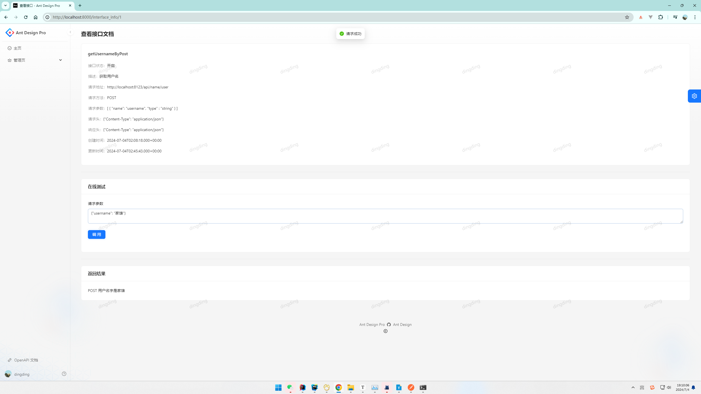


下个项目见。


